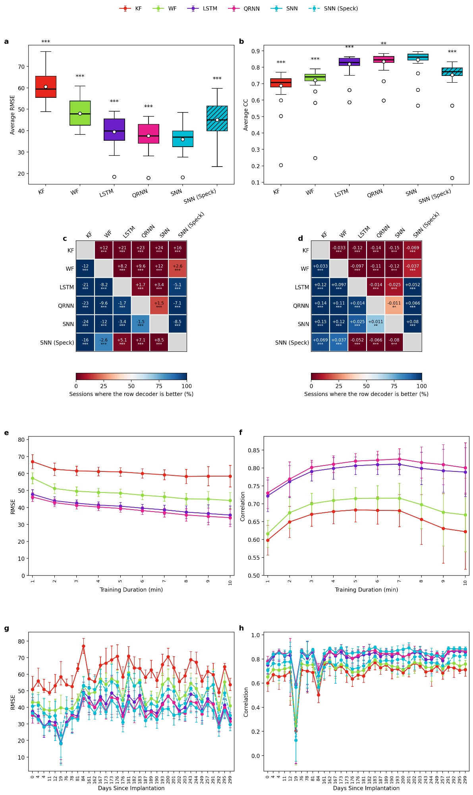
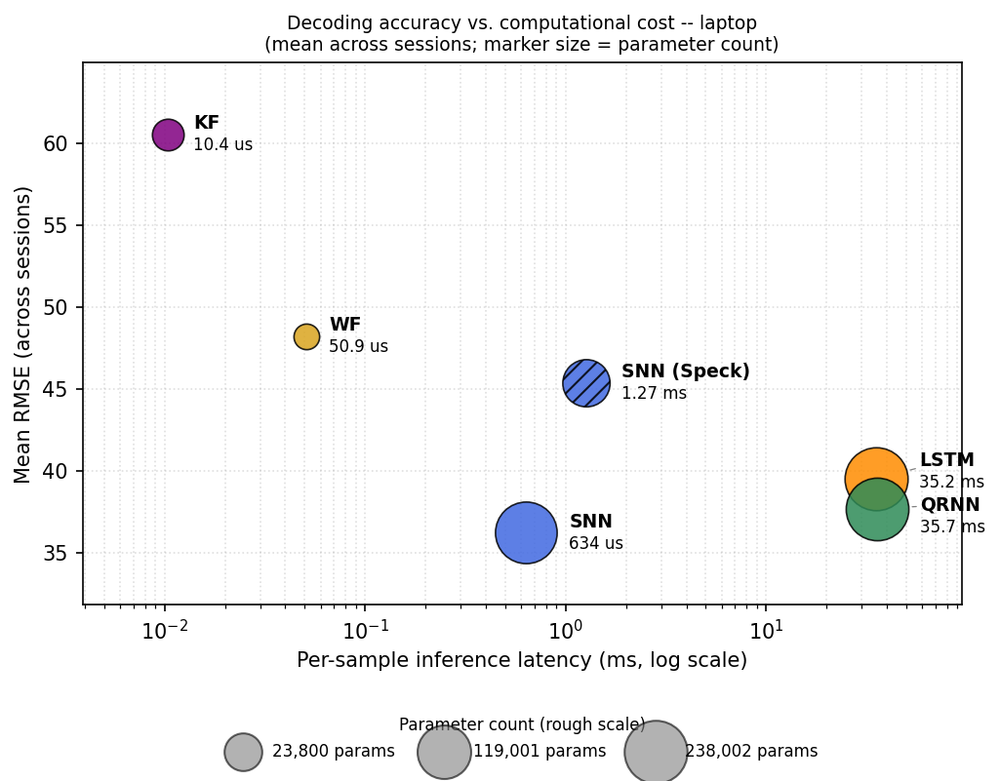
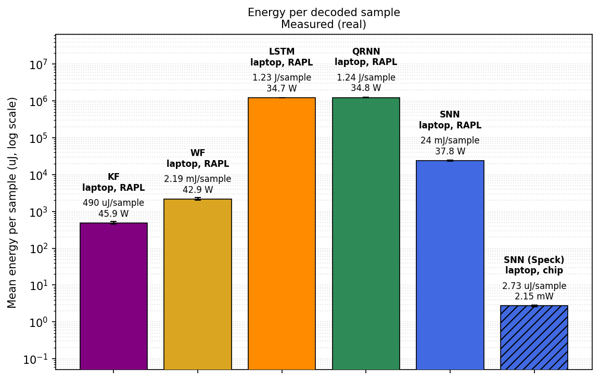
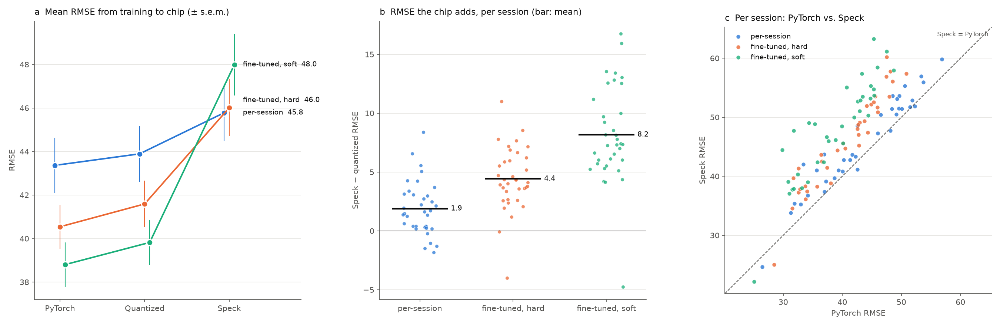

# spike_bmi

Decoding hand velocity from intracortical spiking activity with classical, deep-learning
and spiking decoders, and running the spiking decoder on SynSense's Speck2f
neuromorphic chip.

Each recording session is decoded by six decoders, compared on accuracy (RMSE in mm/s,
and correlation), latency per sample, and energy per sample:

| decoder | what it is |
|---|---|
| `kf` | Kalman filter |
| `wf` | Wiener filter |
| `lstm`, `qrnn` | recurrent networks (TensorFlow) |
| `snn` | feedforward integrate-and-fire SNN (sinabs, PyTorch) with an EMA readout |
| `speck` | the same SNN, quantized and deployed to a Speck2f devkit |

## Layout

```
main/
  preprocessing_training/  raw data -> datasets; trains and evaluates KF, WF, LSTM, QRNN
  nwb_conversion/          datasets for trial-structured NWB sessions (experiment "hkm")
  bmi/                     shared decoding code: preprocessing, decoders, CV loop, metrics
  snn_training/            train_snn.py: trains the SNN
  models/                  SNN model definitions (model_bmi.py, model_hkm.py)
  utils/                   early stopping, checkpoints, training curves for train_snn.py
  inference/               evaluation of every decoder, the report, Speck deployment and diagnosis
  sbatch_scripts/          Slurm jobs for every stage (most also run locally with bash)
  configs/                 SNN training defaults
docs/                      figures referenced below
```

Every script opens with a docstring saying what it reads, what it writes and how to run
it. Data live under one root (`BMI_DATA_ROOT` / `DATA_ROOT`), laid out as
`datasets/`, `snn_datasets/`, `snn_checkpoints/` and `results/`.

## Workflow

1. **Datasets and classical/DL decoders.** `preprocessing_training/single_subject_pipeline.py`
   runs one session end to end: raw `.mat` → binned spikes and kinematics (4 ms bins) →
   ANN and SNN datasets → KF, WF, LSTM and QRNN, trained on all data and per training
   duration. On the cluster: `sbatch_scripts/run_bmi_subject_pipeline_array.sbatch`.
   Every stage skips outputs that already exist.
2. **SNN training.** `snn_training/train_snn.py`, driven by:
   - `run_snn_sweep.sbatch`: an architecture/hyperparameter sweep, per session
     (`--plan`, then submit the printed command).
   - `run_snn_pooled_pretrain.sbatch`, then `run_snn_pooled_finetune_array.sbatch`:
     pretrain the "medium" network (256 → 128) on all sessions of a subject, then
     fine-tune it per session. `RESET_TYPE=hard|soft` and `TAU_SYN` select the variant
     (`snn_medium_config.sh`).
   - `run_snn_hkm_array.sbatch`: the HKM version. It trains a series of models on every
     session of every HKM subject from the whole-trial datasets
     (`snn_datasets/hkm/<subject>/mua/<session>`, written by `nwb_conversion/`). Trials have
     different lengths, so it uses `--batch-size 1`: one trial per step. HKM entries in
     `velocity_scalers.json` are required first (`compute_velocity_scalers.py --experiments bmi hkm`).
     Run `--plan` first, then submit the printed command.
3. **Inference and report.** `bash sbatch_scripts/run_inference.sbatch --submit bmi indy`
   evaluates every decoder on every session (`inference/test_all_decoders.py`), then builds
   `combined_metrics*.json` and the efficiency, energy and 4x2 comparison figures
   (`inference/make_report.py`).
   - **Overriding settings:** put them after the subject, e.g.
     `... --local bmi indy SNN_CHECKPOINT_ROOT=... FIGURES=1`. A `NAME=value` typed on a
     shell line of its own is not seen by the script. The script prints the paths it uses.
   - **Rebuild only the report:** `--report bmi indy`. Training-duration results that the
     session files lack are kept from the existing `combined_metrics_durations.json` (or taken
     from `DURATIONS_JSON=...`), so cluster durations survive a laptop report.
   - **Redraw only the per-session figures and crosshair GIFs:**
     `--figures bmi indy FIGURE_DECODERS=snn,speck`. This draws from the saved predictions,
     with no evaluation and no chip. The GIF grid is two panels wide (ground truth, one panel
     per decoder, overlay).
4. **Speck.** On the devkit-connected laptop, `bash sbatch_scripts/run_inference.sbatch --local bmi indy`
   runs the same evaluation in series with `speck` added. Copy the cluster's
   `sessions/*.json` in first to extend them. `inference/export_test_split.py` writes the
   test-only data the laptop needs. `speck` runs the SNN checkpoints unless
   `SPECK_CHECKPOINT_ROOT` (and `SPECK_CHECKPOINT_SUBDIR`) name others. The PyTorch SNN and
   the chip can then be scored with different checkpoints on the same test rows; a changed
   checkpoint re-runs the full-data section.
5. **Speck diagnosis** (no devkit needed, from `main/inference`):
   - `diagnose_speck.py` scores each session's checkpoint as trained (`pytorch`) and as
     quantized for the chip, next to the saved `snn` and `speck` results. It also compares
     the chip's output spikes with the quantized network's step by step: spike ratio,
     agreement, delay, re-decoding and a cross-validated readout re-fit. It writes
     `speck_diagnosis.json`.
   - `probe_speck.py` (with the devkit) measures how a single chip neuron integrates and
     fires.
   - `compare_speck_runs.py` draws the figure below from up to three
     `speck_diagnosis.json` files.

## Findings

### Decoders (indy, 36 sessions)

- **PyTorch SNN:** `full_cohort_finetuned_optimal` checkpoints (pretrained on all sessions,
  fine-tuned per session).
- **Speck:** per-session hard-reset checkpoints, the best case for the chip (see below).
- **Where it ran:** everything on the Speck-connected laptop. Training durations come from
  the cluster.



| decoder | RMSE | CC | latency / sample | energy / sample |
|---|---|---|---|---|
| KF | 60.5 | 0.69 | 0.010 ms | ≈ 500 µJ (RAPL) |
| WF | 48.0 | 0.72 | 0.05 ms | ≈ 2,000 µJ (RAPL) |
| LSTM | 39.5 | 0.82 | ≈ 35 ms | ≈ 1.2 J (RAPL) |
| QRNN | 37.6 | 0.83 | ≈ 35 ms | ≈ 1.2 J (RAPL) |
| SNN (PyTorch, CPU) | **36.0** | **0.84** | ≈ 0.65 ms | ≈ 24,000 µJ (RAPL) |
| SNN on Speck2f | 45.1 | 0.75 | ≈ 1.3 ms | **2.7 µJ** (chip power monitor) |

These are means across sessions, rounded. The exact values are in
`results/test_all_decoders/bmi/indy/` (`combined_metrics.json`, `efficiency_summary.json`).

**How to read the 4x2 figure**
- **a/b:** one point per session. The box spans the quartiles, the line is the median, the
  white dot is the mean, and the whiskers reach 1.5 × the box height.
- **Stars in a/b:** a paired Wilcoxon signed-rank test against the best decoder, corrected
  for multiple comparisons (Holm).
- **c/d, colour:** how often the row decoder beats the column decoder across sessions.
- **c/d, text:** the median paired difference (row − column), with Holm-corrected stars.

**Takeaways**
- **Accuracy.** The fine-tuned SNN is the most accurate decoder on both RMSE and CC.
  - It beats QRNN by a median 1.5 RMSE and 0.011 CC per session (RMSE p < 0.001, CC p < 0.01).
  - It beats LSTM by 3.4 RMSE and 0.025 CC.
  - The margins over the recurrent networks are small but consistent: the SNN wins in
    most sessions.
- **Speck.** The chip is 8.5 RMSE (0.08 CC) behind the fine-tuned SNN, but it still
  beats both classical decoders in paired comparisons.
  - Against WF: 2.6 RMSE better, 0.037 CC better.
  - Against KF: 16 RMSE better.
  - About 2 RMSE of the gap is the chip's own penalty: the same per-session checkpoints
    score about 43.4 in PyTorch.
  - The rest is the choice of model. The fine-tuned checkpoints lose more on the chip than
    they gain (see below).
- **Energy.** Speck needs about 2.7 µJ per sample.
  - That is about 9,000× less than the SNN on the laptop CPU.
  - It is about 450,000× less than LSTM/QRNN.
  - It is about 180× less than even the Kalman filter.
  - RAPL measures the whole CPU package and the chip monitor only the chip, so these ratios
    compare deployments, not arithmetic.
- **Latency.** Speck takes about 1.3 ms per 4 ms bin, so it keeps up in real time. The SNN
  on CPU takes about 0.65 ms, LSTM/QRNN about 35 ms (slower than the 4 ms bins they decode).
- **Training data (e/f; KF, WF, LSTM, QRNN only).**
  - Every decoder improves with more training data, most steeply in the first 2–3 minutes.
  - LSTM and QRNN trained on 2 minutes already match WF trained on 10.
  - Their CC levels off after about 5–7 minutes.
  - KF and WF CC falls after 7 minutes, and the CIs widen there. Probably fewer sessions
    have that much training data; this was not checked.
- **Over time (g/h).** No decoder degrades across about 300 days after implantation, and
  the ranking stays the same from session to session.
  - The day-19 session is poor for every decoder (CC about 0.2), and day 84 dips too.
  - Since all decoders dip together, those sessions point to the recordings, not the
    decoders.

| accuracy vs. latency (marker area ~ parameter count) | energy per sample |
|---|---|
|  |  |

**Bottom line.**
- **Off-chip:** the pretrained and fine-tuned SNN is the most accurate decoder tested. It
  is also 50× faster than the recurrent networks and uses 50× less energy than them on the
  same CPU.
- **On Speck:** the SNN decodes in real time at a few µJ per sample. It beats the
  classical decoders, at a cost of about 9 RMSE relative to the best PyTorch SNN.
- **What limits Speck:** the chip's per-event dynamics (below), not quantization or the
  readout.

### Where Speck loses accuracy

Three SNN training runs were deployed to the same chip, all with IAF neurons. Neither
LIF neurons nor a synaptic stage (τ_syn) can be deployed to it.



| run | PyTorch | quantized | Speck | chip adds | chip / quantized output spikes |
|---|---|---|---|---|---|
| per-session, hard reset | 43.36 | 43.89 | **45.78** | 1.9 | 1.9× |
| pretrained + fine-tuned, hard reset | 40.54 | 41.59 | **46.01** | 4.4 | 1.6× |
| pretrained + fine-tuned, soft reset | 38.80 | 39.82 | **47.99** | 8.2 | 1.3× |

(Means over sessions with chip results: 36, 36 and 35.)

**What was ruled out**
- **Quantization:** about 1 RMSE (8-bit weights, integer thresholds).
- **Decoding:** the chip's output spikes, re-decoded on the host, reproduce the Speck RMSE
  exactly.
- **Readout delay:** no delay makes the chip's spikes line up with the quantized network's.
  Correlation per step is about 0.03 with no shift and at most about 0.1 at any delay up to
  50 steps. Removing the best delay gains about 1 RMSE.
- **Readout calibration:** a readout re-fitted to the chip's spikes (cross-validated) does no
  better than about 47 in any run. The chip's output carries less information than the
  quantized network's, and no readout recovers it.
- **Soft reset:** on the chip it is worse than hard reset, although it is better in PyTorch.
- **Binarized input:** per-session models retrained with each input channel clipped to at
  most one spike per 4 ms bin reach Speck 45.67 on 30 sessions, with the same chip penalty
  (about 2 RMSE) and spike ratio (about 1.9×). Few bins held more than one spike, so the
  inputs barely changed, and capping events per channel leaves each neuron summing events from
  many channels per timestep.

**How the chip differs from training** (`probe_speck.py`, single neuron on a Speck2f devkit)
- **Training model:** each timestep's input is summed, then the neuron fires ⌊v/θ⌋ spikes
  and resets.
- **Chip, per event:** the neuron is updated after every input event and fires at most once
  per event.
- **Chip, reset:** the configured reset (hard or soft) is applied after each spike.
- **Chip, after a reset:** the first input event after a membrane reset is lost.

So within a timestep the chip's result depends on the order in which excitatory and
inhibitory events arrive. It also cannot emit several spikes for one large input. The chip
does keep membrane potential across timesteps: IAF, no leak, in integers.

**Interpretation.** Per-feature firing rates agree well (correlation 0.78–1.0), and so does
the EMA-smoothed output (0.8–0.96). The timing of individual spikes does not: per step the
chip and the quantized network agree at about 0.03.

The chip adds more error the more a model relies on stored state:

| run | stored state | chip adds |
|---|---|---|
| per-session | each spike wipes the membrane | 1.9 |
| fine-tuned | fewer spikes, longer-lived sub-threshold charge | 4.4 |
| soft reset | every spike's remainder is kept | 8.2 |

## Requirements

Python 3.11 with numpy, scipy, scikit-learn, h5py, matplotlib, Pillow, PyTorch, sinabs
(≥ 3) and TensorFlow (LSTM/QRNN). The Speck decoder also needs samna and a Speck2f devkit.
`diagnose_speck.py` and `compare_speck_runs.py` need sinabs but no devkit.
