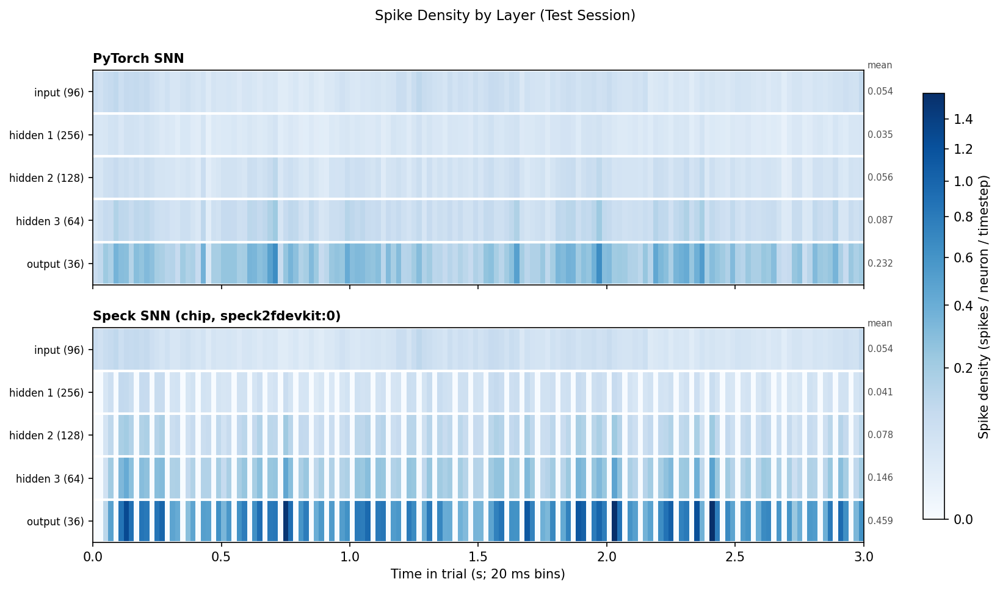

# spike_bmi

Decoding hand velocity from intracortical spiking activity with classical, deep-learning
and spiking decoders, and running the spiking decoder on SynSense's Speck2f
neuromorphic chip.

Each recording session is decoded by six decoders, compared on accuracy (RMSE in mm/s,
and correlation), latency per sample, and energy per sample:

| decoder | what it is |
|---|---|
| `kf` | Kalman filter |
| `wf` | Wiener filter |
| `lstm`, `qrnn` | recurrent networks (TensorFlow) |
| `snn` | feedforward integrate-and-fire SNN (sinabs, PyTorch) with an EMA readout |
| `speck` | the same SNN, quantized and deployed to a Speck2f devkit |

## Layout

```
main/
  preprocessing_training/  raw data -> datasets; trains and evaluates KF, WF, LSTM, QRNN
  nwb_conversion/          datasets for the trial-structured NWB sessions (experiment "hkm")
  bmi/                     shared decoding code: preprocessing, decoders, CV loop, metrics
  snn_training/            train_snn.py: trains the SNN
  models/                  SNN model definitions (model_bmi.py, model_hkm.py)
  utils/                   early stopping, checkpoints, training curves for train_snn.py
  inference/               evaluation of every decoder, the report, Speck deployment and diagnosis
  sbatch_scripts/          Slurm jobs for every stage (most also run locally with bash)
  configs/                 SNN training defaults
docs/                      figures referenced below
```

Every script opens with a docstring saying what it reads, what it writes and how to run
it. Data live under one root (`BMI_DATA_ROOT` / `DATA_ROOT`), laid out as
`datasets/`, `snn_datasets/`, `snn_checkpoints/` and `results/`.

## Workflow

The final pipeline, run the same way for all four subjects: bmi `indy` and `loco`
(continuous `.mat` sessions), hkm `jenkins` and `nitschke` (NWB sessions of separate
reaches; see [HKM](#hkm-jenkins-nitschke) for what differs). Steps 1–4 run on the
cluster, step 5 on the Speck-connected laptop, so every decoder's speed, energy and
accuracy is measured on one platform.

1. **Datasets, KF, WF, LSTM, QRNN.** `preprocessing_training/single_subject_pipeline.py`
   runs one session: raw data → binned spikes and kinematics (4 ms bins) → ANN and SNN
   datasets → each decoder fit once on the session's training split. No cross-validation
   folds and no per-duration models by default (`--cv_folds 2`, `--durations 1,2,...,10`
   add them). Arrays: `run_bmi_subject_pipeline_array.sbatch`; for hkm first
   `nwb_conversion/run_hkm_nwb_pipeline_array.sbatch`, then
   `run_hkm_subject_pipeline_array.sbatch`. Every stage skips outputs that already exist.
2. **Velocity scalers** (once, after the SNN datasets exist):
   `python compute_velocity_scalers.py --snn-datasets-root $DATA_ROOT/snn_datasets
   --output ../snn_training/velocity_scalers.json` (merged into the file).
3. **SNN for PyTorch ('snn'):** `run_snn_pooled_pretrain.sbatch`, then
   `run_snn_pooled_finetune_array.sbatch` (chained per session; see the pretrain script's
   header). 512 → 256 → 128, threshold 1.0, 2 EMA stages, `tau_syn` initialized at 2, 4, 8
   and 16 over the four spiking layers and trained. Leave-one-session-out by default
   (`LOSO=1`): session i is fine-tuned from a model pretrained on every other session, so
   its own data never reaches pretraining. At most 50 epochs per stage for bmi, 10 for hkm.
   → `snn_checkpoints/<exp>/<subject>/loso_finetuned/<session>/`
4. **SNN for Speck ('speck'):** `run_snn_per_session_array.sbatch`. 256 → 128 → 64,
   threshold 1.0, 2 EMA stages, no `tau_syn` (the chip has no synaptic stage), trained
   per session from scratch. At most 50 epochs for bmi, 20 for hkm.
   → `snn_checkpoints/<exp>/<subject>/per_session/<session>/`

   Both configurations are in `sbatch_scripts/snn_config.sh`. Every SNN trains on
   **binarized input** (spike counts clipped to 0/1, `train_snn.py --binarize-input`,
   default): the chip raises a neuron's membrane once per input event, so bins of several
   spikes drove the deployed network into runaway spiking. The setting is stored in each
   checkpoint, and inference, profiling, the chip run and the diagnosis binarize the same
   way (checkpoints made before it are evaluated unbinarized, as trained).
   `run_snn_sweep.sbatch` remains for architecture sweeps.
5. **Inference, report and Speck diagnosis**, on the laptop, per subject:
   `bash sbatch_scripts/run_inference.sbatch --local <exp> <subject>` (e.g. `--local bmi indy`).
   - Evaluates every decoder on every session (`inference/test_all_decoders.py`): accuracy,
     latency and energy per sample, `speck` on the devkit. `snn` runs the `loso_finetuned`
     checkpoints and `speck` the `per_session` ones (`SNN_CHECKPOINT_ROOT=`,
     `SPECK_CHECKPOINT_ROOT=` override them).
   - Builds the report (`inference/make_report.py`): `combined_metrics.json`,
     `efficiency_summary.json`, and the efficiency, energy and comparison figures. The
     comparison figure has three rows (accuracy, pairwise comparisons, accuracy over
     time); the training-duration row is added only when durations are evaluated
     (`TRAIN_DURATIONS=1,2,...`, which needs per-duration models) or supplied
     (`DURATIONS_JSON=...`).
   - Runs `inference/diagnose_speck.py` on the `per_session` checkpoints: the
     PyTorch → quantized → chip comparison (`speck_diagnosis.json`) and every session's
     layer spike-density figure and GIF (`speck_layer_activity_<session>.png/.gif`),
     recorded on the devkit (`SPIKE_DENSITY=0` skips this step).
   - The laptop needs the datasets' test splits (`inference/export_test_split.py` writes
     test-only copies of the ANN datasets), the model bundles, both checkpoint folders and
     `snn_datasets/.../<session>/test/`.
   - **Overriding settings:** put them after the subject, e.g.
     `... --local bmi indy FIGURES=1`. A `NAME=value` typed on a shell line of its own is
     not seen by the script. The script prints the paths it uses. `FIGURES=1` also saves
     per-session diagnostic figures and crosshair GIFs (`FIGURE_DECODERS=snn,speck` limits
     them).
   - **Rebuild only the report:** `--report <exp> <subject>`. **Redraw only the per-session
     figures** from the saved predictions (no evaluation, no chip): `--figures <exp> <subject>`.
   - `--submit` runs the same evaluation (without the chip) as Slurm jobs.
6. **Other Speck tools** (from `main/inference`): `probe_speck.py` (with the devkit)
   measures how a single chip neuron integrates and fires; `compare_speck_runs.py` draws
   one figure from up to three `speck_diagnosis.json` files.

### HKM (Jenkins, Nitschke)

The HKM sessions are NWB files of separate reaches: about 2000–3000 trials per
session, with most of the recording rest between them. Each reach is therefore
decoded as its own trial, from rest, never as part of one continuous recording.

1. **Datasets.** `nwb_conversion/run_hkm_nwb_pipeline_array.sbatch` (one task per
   session; `SUBJECT=` limits it to one subject) runs `run_nwb_pipeline.sh`:
   - every trial becomes its own raw file, after hand-tracking glitches are removed
     from the native position samples (`hkm_despike.py`; the Nitschke sessions hold a
     few hundred position jumps each, which would otherwise become velocity spikes of
     ~70,000 units/s);
   - ANN dataset: 256 ms windows at 4 ms steps within each trial, concatenated
     (`dataset/hkm/<subject>/mua/<session>_binning.h5`). A trial of T samples gives
     T − 65 rows, and each row records its trial;
   - SNN dataset: one `.pkl` per whole trial, of its own length
     (`snn_datasets/hkm/<subject>/mua/<session>/`);
   - both hold out the same last trials as the test split (`trial_split.py`), and the
     build fails if any velocity glitch survived.

   Every run rebuilds its session from scratch. Datasets built before this version
   lack the trial IDs inference needs, so rebuild them, then retrain every decoder.
2. **KF, WF, LSTM, QRNN.** `sbatch_scripts/run_hkm_subject_pipeline_array.sbatch`
   trains them on the concatenated windows, with the train/test boundary taken from
   the dataset (a trial boundary, so no purge gap is needed; WF uses 8 taps: 192 channels
   × 15 taps exhausts memory). Set `OVERWRITE=1` on the first run after rebuilding the
   datasets.
3. **SNN.** The same scripts as bmi with `EXPERIMENT=hkm`. Trials differ in length, so
   HKM trains with batch size 1, one trial per step with the state reset at its start. An
   epoch takes about an hour per session, so HKM checkpoints every epoch and resumes when
   re-submitted.
4. **Inference.** Every SNN test trial runs from rest (the chip is reset before each,
   about 1 s per layer), and its timesteps 65 … T − 1 are scored on that trial's own ANN
   rows. Trials of 65 samples or fewer have no ANN rows and are not scored. The other
   decoders are scored on the same rows. Before scoring, inference checks that the two
   datasets hold out the same trials with the same velocity, and compares the SNN's mean
   per-trial RMSE with the loss recorded in its checkpoint (`training_check` in the
   session results; they match to within 0.1% for a checkpoint selected on that
   session). The per-session figures show one trial per grid panel; the spike-density
   figure follows the session's longest test trial.
   - **Transition only:** datasets built before trial IDs were stored can be evaluated with
     `LEGACY_HKM=1` (`inference/test_all_decoders_legacy_hkm.py`), which matches the SNN
     test trials to ANN rows by velocity and writes to `results/test_all_decoders_legacy/`.

## Findings

These results predate the final pipeline above: they come from earlier bmi runs
(unbinarized input, other SNN configurations) and will be replaced by its results.

### Decoders (indy, 36 sessions)

- **PyTorch SNN:** `loso_finetuned_optimal` checkpoints (pretrained, then fine-tuned per
  session).
- **Speck:** per-session hard-reset checkpoints, the best case for the chip (see below).
- **Where it ran:** everything on the Speck-connected laptop. Training durations come from
  the cluster.


| decoder | RMSE | CC | latency / sample | energy / sample | mean power |
|---|---|---|---|---|---|
| KF | 60.5 | 0.69 | 10.4 µs | 490 µJ (RAPL) | 45.9 W |
| WF | 48.2 | 0.72 | 50.9 µs | 2.19 mJ (RAPL) | 42.9 W |
| LSTM | 39.5 | 0.82 | 35.2 ms | 1.23 J (RAPL) | 34.7 W |
| QRNN | 37.6 | 0.83 | 35.7 ms | 1.24 J (RAPL) | 34.8 W |
| SNN (PyTorch, CPU) | **36.2** | **0.85** | 634 µs | 24 mJ (RAPL) | 37.8 W |
| SNN on Speck2f | 45.3 | 0.75 | 1.27 ms | **2.73 µJ** (chip power monitor) | **2.15 mW** |

These are means across sessions; RMSE and CC are rounded. The exact values are in
`results/test_all_decoders/bmi/indy/` (`combined_metrics.json`, `efficiency_summary.json`).
Energy per sample = mean power × latency per sample (see
[How the figures were made](#how-the-figures-were-made)): the CPU decoders all draw
35–46 W, so their energy differs mainly through their latency.

**How to read the 4x2 figure**
- **a/b:** one point per session. The box spans the quartiles, the line is the median, the
  white dot is the mean, and the whiskers reach 1.5 × the box height.
- **Stars in a/b:** a paired Wilcoxon signed-rank test against the best decoder, corrected
  for multiple comparisons (Holm).
- **c/d, colour:** how often the row decoder beats the column decoder across sessions.
- **c/d, text:** the median paired difference (row − column), with Holm-corrected stars.
- **e/f** are empty in this version: the laptop run did not carry over the cluster's
  training-duration results. The training-data takeaways below are from the earlier report;
  `run_inference.sbatch --report bmi indy DURATIONS_JSON=<cluster combined_metrics_durations.json>`
  restores the panels.

**Takeaways**
- **Accuracy.** The fine-tuned SNN is the most accurate decoder on both RMSE and CC.
  - It beats QRNN by a median 1.2 RMSE and 0.008 CC per session (RMSE p < 0.001, CC p < 0.01).
  - It beats LSTM by 3.1 RMSE and 0.021 CC.
  - The margins over the recurrent networks are small but consistent: the SNN wins in
    most sessions.
- **Speck.** The chip is a median 9.2 RMSE (0.08 CC) behind the fine-tuned SNN, but it
  still beats both classical decoders in paired comparisons.
  - Against WF: 2.5 RMSE better, 0.034 CC better.
  - Against KF: 15 RMSE better, 0.067 CC better.
  - About 2 RMSE of the gap is the chip's own penalty: the same per-session checkpoints
    score about 43.4 in PyTorch.
  - The rest is the choice of model. The fine-tuned checkpoints lose more on the chip than
    they gain (see below).
- **Energy.** Speck needs 2.73 µJ per sample, at a mean chip power of 2.15 mW.
  - That is about 9,000× less than the SNN on the laptop CPU.
  - It is about 450,000× less than LSTM/QRNN.
  - It is about 180× less than even the Kalman filter.
  - RAPL measures the whole CPU package and the chip monitor only the chip, so these ratios
    compare deployments, not arithmetic.
- **Latency.** Speck takes 1.27 ms per 4 ms bin, so it keeps up in real time; about 1 ms of
  that is the fixed wait before its output is read (`--speck_wait_time`). The SNN on CPU
  takes 0.63 ms, LSTM/QRNN about 35 ms (slower than the 4 ms bins they decode).
- **Training data (e/f; KF, WF, LSTM, QRNN only).**
  - Every decoder improves with more training data, most steeply in the first 2–3 minutes.
  - LSTM and QRNN trained on 2 minutes already match WF trained on 10.
  - Their CC levels off after about 5–7 minutes.
  - KF and WF CC falls after 7 minutes, and the CIs widen there. Probably fewer sessions
    have that much training data; this was not checked.
- **Over time (g/h).** No decoder degrades across about 300 days after implantation, and
  the ranking stays the same from session to session.
  - The day-19 session is poor for every decoder (CC about 0.2), and day 84 dips too.
  - Since all decoders dip together, those sessions point to the recordings, not the
    decoders.

| accuracy vs. latency (marker area ~ parameter count) | energy per sample |
|---|---|
|  |  |

**Bottom line.**
- **Off-chip:** the pretrained and fine-tuned SNN is the most accurate decoder tested. It
  is also about 55× faster than the recurrent networks and uses about 50× less energy than
  them on the same CPU.
- **On Speck:** the SNN decodes in real time at a few µJ per sample. It beats the
  classical decoders, at a cost of about 9 RMSE relative to the best PyTorch SNN.
- **What limits Speck:** the chip's per-event dynamics (below), not quantization or the
  readout.

### Where Speck loses accuracy

Three SNN training runs were deployed to the same chip, all with IAF neurons. Neither
LIF neurons nor a synaptic stage (τ_syn) can be deployed to it.


| run | PyTorch | quantized | Speck | chip adds | chip / quantized output spikes |
|---|---|---|---|---|---|
| per-session, hard reset | 43.36 | 43.89 | **45.78** | 1.9 | 1.9× |
| pretrained + fine-tuned, hard reset | 40.54 | 41.59 | **46.01** | 4.4 | 1.6× |
| pretrained + fine-tuned, soft reset | 38.80 | 39.82 | **47.99** | 8.2 | 1.3× |

(Means over sessions with chip results: 36, 36 and 35.)

**What was ruled out**
- **Quantization:** about 1 RMSE (8-bit weights, integer thresholds).
- **Decoding:** the chip's output spikes, re-decoded on the host, reproduce the Speck RMSE
  exactly.
- **Readout delay:** no delay makes the chip's spikes line up with the quantized network's.
  Correlation per step is about 0.03 with no shift and at most about 0.1 at any delay up to
  50 steps. Removing the best delay gains about 1 RMSE.
- **Readout calibration:** a readout re-fitted to the chip's spikes (cross-validated) does no
  better than about 47 in any run. The chip's output carries less information than the
  quantized network's, and no readout recovers it.
- **Soft reset:** on the chip it is worse than hard reset, although it is better in PyTorch.
- **Binarized input:** per-session models retrained with each input channel clipped to at
  most one spike per 4 ms bin reach Speck 45.67 on 30 sessions, with the same chip penalty
  (about 2 RMSE) and spike ratio (about 1.9×). Few bins held more than one spike, so the
  inputs barely changed, and capping events per channel leaves each neuron summing events from
  many channels per timestep.

**How the chip differs from training** (`probe_speck.py`, single neuron on a Speck2f devkit)
- **Training model:** each timestep's input is summed, then the neuron fires ⌊v/θ⌋ spikes
  and resets.
- **Chip, per event:** the neuron is updated after every input event and fires at most once
  per event.
- **Chip, reset:** the configured reset (hard or soft) is applied after each spike.
- **Chip, after a reset:** the first input event after a membrane reset is lost.

So within a timestep the chip's result depends on the order in which excitatory and
inhibitory events arrive. It also cannot emit several spikes for one large input. The chip
does keep membrane potential across timesteps: IAF, no leak, in integers.

**Interpretation.** Per-feature firing rates agree well (correlation 0.78–1.0), and so does
the EMA-smoothed output (0.8–0.96). The timing of individual spikes does not: per step the
chip and the quantized network agree at about 0.03.

The chip adds more error the more a model relies on stored state:

| run | stored state | chip adds |
|---|---|---|
| per-session | each spike wipes the membrane | 1.9 |
| fine-tuned | fewer spikes, longer-lived sub-threshold charge | 4.4 |
| soft reset | every spike's remainder is kept | 8.2 |

### Spike density through the layers

One test trial (3 s) of one session, through the per-session Speck checkpoint (96 inputs →
256 → 128 → 64 → 36 outputs), in PyTorch (top) and recorded on the chip with every layer
monitored (bottom). Colour is spike density, the mean over a layer's neurons of spikes per
timestep, in 20 ms bins; each layer's mean over the trial is printed on the right.
`speck_layer_activity_<session>.gif` animates the same data, the layers drawn left to right.



| layer | PyTorch | Speck | Speck / PyTorch |
|---|---|---|---|
| input (96) | 0.054 | 0.054 | 1.0× |
| hidden 1 (256) | 0.035 | 0.041 | 1.2× |
| hidden 2 (128) | 0.056 | 0.078 | 1.4× |
| hidden 3 (64) | 0.087 | 0.146 | 1.7× |
| output (36) | 0.232 | 0.459 | 2.0× |

- **The chip's excess activity builds up layer by layer.** With identical input, the first
  hidden layer fires 1.2× as much as in PyTorch and the output 2×. That matches the
  output-spike ratio in the table above (1.9× for the per-session run). It fits the per-event
  dynamics described there: each layer adds a little extra firing, and the next layer
  amplifies it.
- **The chip's spikes arrive in bursts.** In the chip rows, every hidden and output layer
  is silent together for one or two 20 ms bins at a time, while the input keeps arriving.
  This was not investigated further. Because all layers drop out together, it most likely
  reflects how the monitored events reach the host (they are counted in the timestep in
  which they are read), not the network itself. Monitoring every layer streams all of their
  spikes to the host, which the normal decoding run does not do.

## How the figures were made

Every decoder is scored on the same rows of each session's chronological test split (the
last 10% of the session), with velocity in mm/s. The report figures are drawn by
`inference/make_report.py` from the per-session results of `inference/test_all_decoders.py`;
the layer-activity figure by `inference/diagnose_speck.py`.

**Accuracy (4x2 figure, a–d, g–h)**
- **RMSE:** per velocity axis over all test rows of a session, then averaged over x and y.
- **CC:** Pearson correlation per axis, averaged over x and y.
- **Error bars in g/h:** a 95% t-interval over 10 contiguous chunks of the test split.
- **Statistics:** paired Wilcoxon signed-rank tests across sessions, Holm-corrected within
  each panel. Only sessions with results for every decoder are used.

**Latency** (`inference/profiling.py`; `inference/speck.py` for Speck)
- **One prediction per call, never batched,** as a real-time decoder runs: one new 4 ms
  sample at a time, so per-call framework overhead counts.
- **CPU decoders:** 50 test samples (`--n_timing_samples`) are predicted one per call. After
  untimed warm-up passes (Keras traces its graph on the first call), latency is the median
  over 3 timed passes (2 for LSTM, QRNN and SNN) of the pass time divided by the number of
  samples.
- **SNN (PyTorch):** fed one timestep per forward call, with state reset only at the start
  of a test trial.
- **Speck:** wall time per timestep of the chip loop over the whole test split. Each step
  writes that step's input spikes to the chip as events, waits `--speck_wait_time` (1 ms),
  then reads the output layer's spikes. The wait is part of the latency.
- **Threads:** math libraries are pinned to one thread on the laptop
  (`ENERGY_METER_NUM_THREADS=1`), so the CPU decoders are timed on one core.
- **Efficiency figure:** means across sessions, one panel per machine (here, everything ran
  on the Speck laptop). Marker area grows with the square root of the parameter count.

**Energy and power** (`inference/energy_meter.py`; `inference/speck.py` for Speck)
- **CPU decoders, RAPL (measured):** a separate, longer block of 10 passes
  (`--n_energy_repeats`) runs between two reads of the Intel RAPL energy counters of the CPU
  package domains (`/sys/class/powercap/intel-rapl/intel-rapl:N/energy_uj`, domains named
  `package-N`; platform domains such as `psys` are excluded). Energy per sample is the
  difference divided by the number of predictions in the block. Mean power is the same
  difference divided by the block's wall time.
- **CPU decoders, proxy (estimated):** where RAPL cannot be read (no Intel CPU, or no read
  permission), energy is estimated as elapsed time × the process's CPU utilisation × an
  assumed 65 W TDP. It is only good for comparing workloads with each other, so the energy
  figure draws proxy estimates in their own "Estimated (proxy, not measured)" panel. All
  results above are RAPL.
- **Speck (measured):** the devkit's power monitor samples the chip's supply rails at
  100 Hz during the decoding loop. Mean power is the sum over rails of each rail's mean
  sample, after checking the sample count against 100 Hz × loop time. Energy per sample is
  mean power × loop time ÷ number of timesteps.
- **What is included:**
  - RAPL measures the whole CPU package: all cores, the uncore, the idle baseline and
    anything else running. No idle baseline is subtracted, which is why every CPU decoder
    draws 35–46 W.
  - The chip monitor measures only the chip, not the laptop that drives it over USB or runs
    the host-side readout.
  - The ratios between them compare deployments, not arithmetic.
- **Energy figure:** each bar is the mean across sessions, with a 95% CI, labelled with its
  energy per sample and mean power.

**Spike density** (`diagnose_speck.py`; `speck.run_layers()` and `SpeckDevkit(monitor_all=True)`)
- **Trial:** one test trial of one session (`--figure_session`, `--figure_trial`; default
  the first scored trial), first 750 timesteps (3 s; `--figure_start`, `--figure_steps`).
  Both networks start the trial from rest.
- **PyTorch:** the checkpoint's Linear/IAF stack is stepped one timestep at a time, and
  every neuron layer's output spikes are recorded.
- **Speck:** the same input is fed to the chip with monitoring enabled on every layer, and
  each layer's spike events are counted per neuron and timestep. Events still in flight
  after the wait are counted in a later timestep. Without a devkit, the quantized network
  as deployed (8-bit weights, integer thresholds) is emulated on the host instead.
- **Density:** a layer's spike counts are averaged over its neurons and over bins of 5
  timesteps (20 ms; `--figure_bin`), giving spikes per neuron per timestep. It can exceed 1,
  because a neuron can fire several spikes per timestep.
- **Colour:** one sequential colour map for both networks, on a square-root scale so that
  sparse hidden layers stay visible next to the denser output layer.
- **GIF:** the same densities, colours and scale. Each frame is one bin, and the layers are
  drawn left to right in the direction spikes travel, with box height following neuron
  count. 10 frames per second (`--figure_fps`) plays the trial at one-fifth real time.

## Requirements

Python 3.11 with numpy, scipy, scikit-learn, h5py, matplotlib, Pillow, PyTorch, sinabs
(≥ 3) and TensorFlow (LSTM/QRNN); pynwb for the HKM conversion. The Speck decoder also needs samna and a Speck2f devkit.
`diagnose_speck.py` and `compare_speck_runs.py` need sinabs but no devkit.
